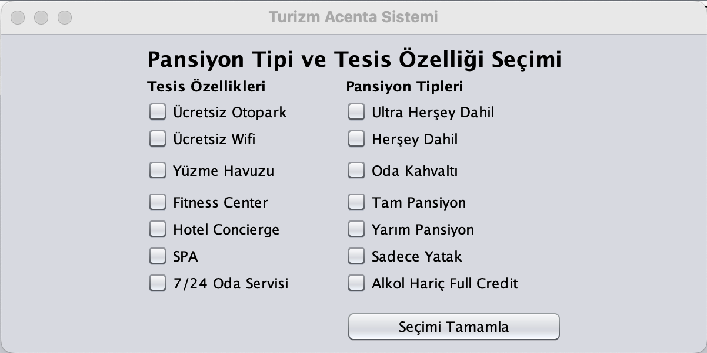
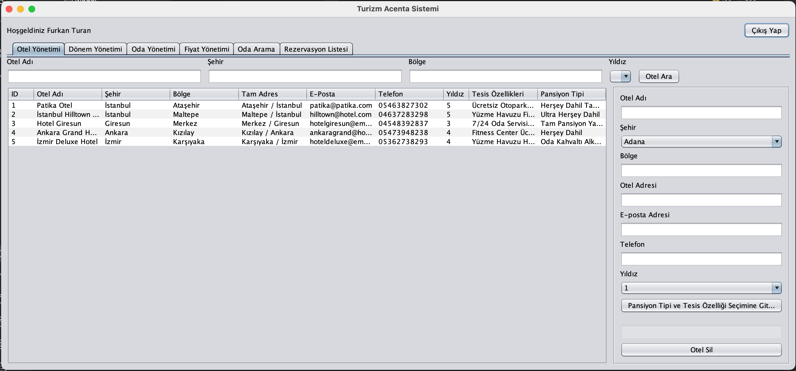
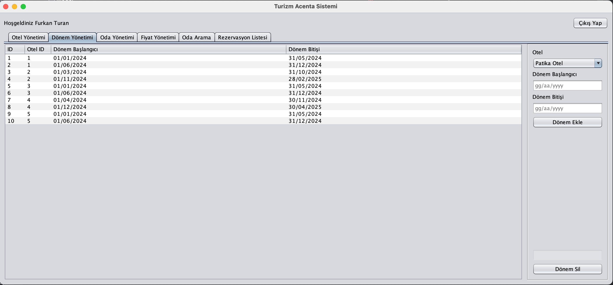
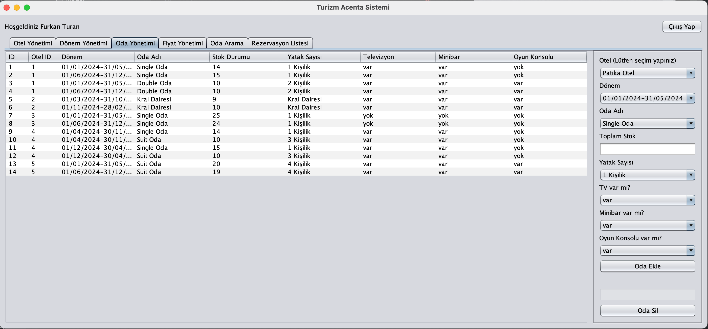
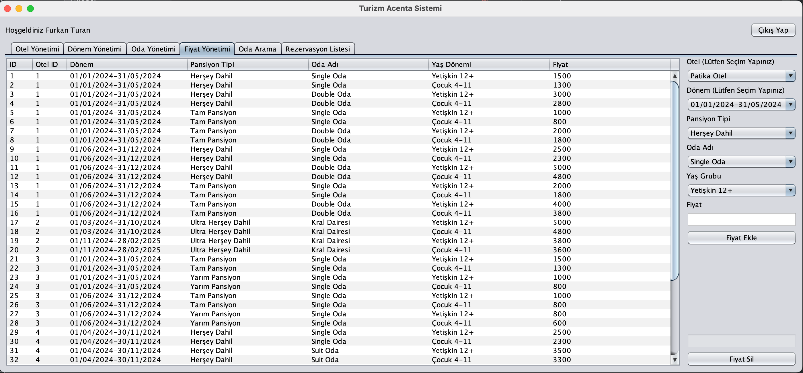
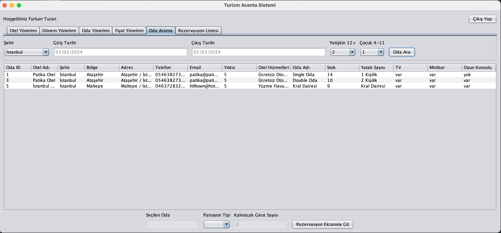
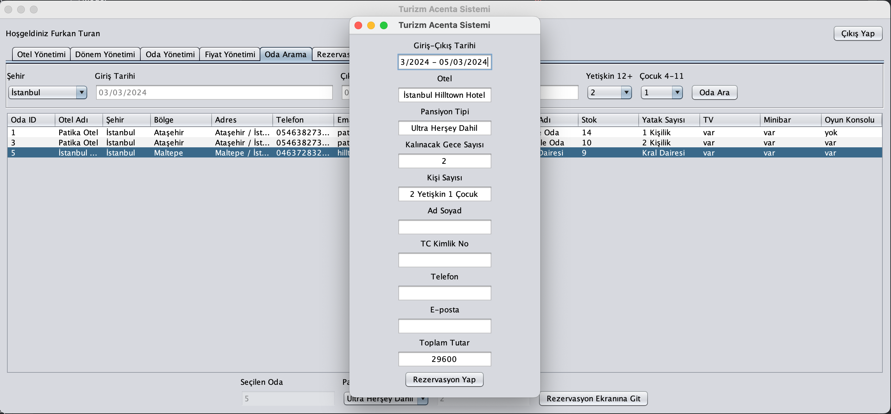
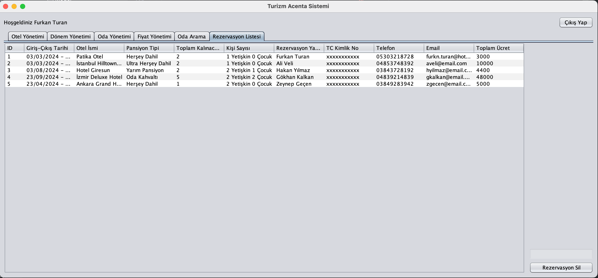
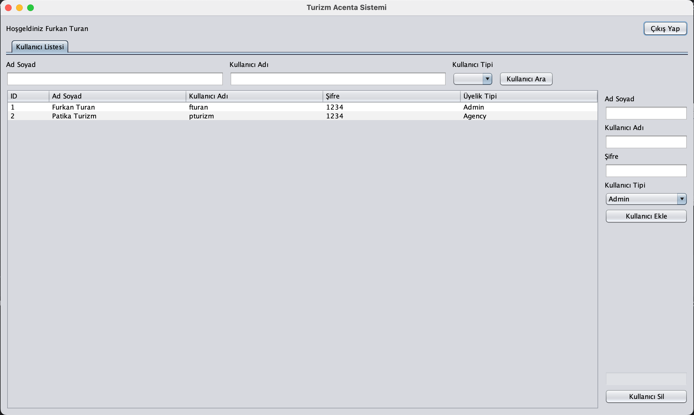

# Patika+ Tourism Agency System Project

## Patika+ Full Stack Web Development Bootcamp Tourism Agency System

The operational logic of Patika Tourism Agency is as follows: Hotels reserve specific rooms for Patika Tourism Agency and expect the agency to sell these rooms. The agency sells these rooms to customers by adding its service fee on top, either as a percentage or a fixed amount.

The agency believes that handling these tasks on paper and manually is time-consuming and is in need of software to facilitate its operations.

### Software features:

#### Hotel Management

The agency manage the hotels it has agreements with, including their location information and other details. When adding a hotel, information such as Hotel Name, Address, Email, Phone, Star Rating, Facility Features, and Board Types should be specified.

##### Board Types in the system:

Ultra All-Inclusive
All-Inclusive
Bed and Breakfast
Full Board
Half Board
Room Only
Full credit excluding alcohol

##### Facility Features in the system:

Free Parking
Free WiFi
Swimming Pool
Fitness Center
Hotel Concierge
SPA
24/7 Room Service

##### Example Hotel Screen:

#### Period Management

Historical periods for hotels are added, and pricing is done based on these periods to provide variable pricing. Prices in the tourism sector are typically seasonal. Periods are defined as two date ranges.

##### Example Period Screen:

#### Room Management

The agency adds the reserved rooms from hotels to the system and provides pricing for these rooms. Stock logic is used to avoid adding the same type of room multiple times in the system. Additionally, room features should be entered.

##### Room Features in the system:

##### Example Room Screen:

#### Pricing

Room prices are calculated on a nightly basis. Prices are defined based on the periods and board types added for the hotel.

##### Pricing in the system:

Prices are defined based on the nightly rates of rooms, including the agency's commission.

#### Room Search and Reservation Operations

Agency employees should be able to search for rooms based on the entered date range, city, and guest information.

#### Room Search Algorithm

After entering the necessary room search information, the agency can list the rooms available in the system.

##### For rooms to appear in the list:

The hotel for the room should be within the desired city.

The hotel should have period information for the entered date range. For example, for a search with an entry date of 09/06/2021 and an exit date of 12/06/2021, hotels should have periods within that date range.

If the hotel has a period, the room should have price information based on board types for the relevant periods, allowing the customer to be provided with pricing information.

The stock quantity of the room should be greater than 0.

##### Example Search Screen:

#### Price Calculation

Prices are calculated based on guest information, the number of nights stayed, and board type.

##### The process involves:

First, finding hotels in the city.

Finding rooms with available stock in the identified hotel.

If there is period price information for the rooms in the specified date range, price calculation is performed.

#### Reservation Process

Agency users complete reservations by selecting the appropriate board type from the listed room types for the hotels.

To complete a reservation:

Customer contact information and guest name, surname, and ID information are entered.

The sale is completed through the system. If the sale is completed, the stock of the respective room is reduced by 1.

#### Reservation List

Agency employees can list the reservations made in the system.

#### User Permissions

Admin: User Management

Tourism Agency Employee: Hotel Management, Room Management, Period Management, Pricing Management, Room Search, Reservation Operations

#### Example Admin Screen:

